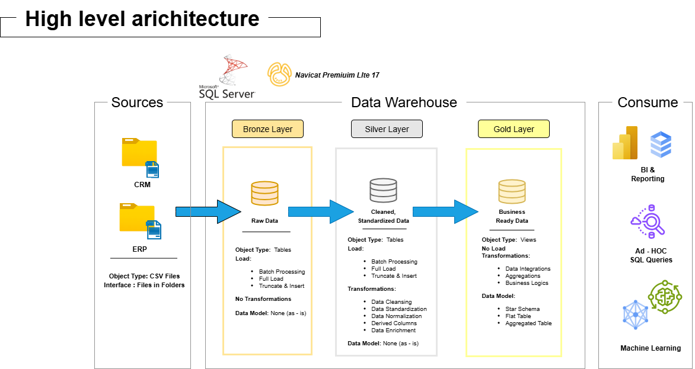

# SQL-DataWarehouse-Project

# Data Warehouse and Analytics Project

Welcome to the **Data Warehouse and Analytics Project** repository! 🚀  
This project demonstrates a comprehensive data warehousing and analytics solution, from building a data warehouse to generating actionable insights. Designed as a portfolio project, it highlights industry best practices in data engineering and analytics.

---
## 🏗️ Data Architecture

The data architecture for this project follows Medallion Architecture **Bronze**, **Silver**, and **Gold** layers:

1. **Bronze Layer**: Stores raw data as-is from the source systems. Data is ingested from CSV Files into SQL Server Database.
2. **Silver Layer**: This layer includes data cleansing, standardization, and normalization processes to prepare data for analysis.
3. **Gold Layer**: Houses business-ready data modeled into a star schema required for reporting and analytics.

---
## 📖 Project Overview

This project involves:

1. **Data Architecture**: Designing a Modern Data Warehouse Using Medallion Architecture **Bronze**, **Silver**, and **Gold** layers.
2. **ETL Pipelines**: Extracting, transforming, and loading data from source systems into the warehouse.
3. **Data Modeling**: Developing fact and dimension tables optimized for analytical queries.
4. **Analytics & Reporting**: Creating SQL-based reports and dashboards for actionable insights.

🎯 This repository is an excellent resource for professionals and students looking to showcase expertise in:
- SQL Development
- Data Architect
- Data Engineering  
- ETL Pipeline Developer  
- Data Modeling  
- Data Analytics  

---

## 🛠️ Important Links & Tools:

Everything is for Free!
- **[Datasets](datasets/):** Access to the project dataset (csv files).
- **[SQL Server Express](https://www.microsoft.com/en-us/sql-server/sql-server-downloads):** Lightweight server for hosting your SQL database.
- **[SQL Server Management Studio (SSMS)](https://learn.microsoft.com/en-us/sql/ssms/download-sql-server-management-studio-ssms?view=sql-server-ver16):** GUI for managing and interacting with databases.
- **[DrawIO](https://www.drawio.com/):** Design data architecture, models, flows, and diagrams.
- **[Notion](https://www.notion.com/templates/sql-data-warehouse-project):** Get the Project Template from Notion
- **[Notion Project Steps](https://www.notion.so/Data-Warehouse-Project-26e3e6677bbe80b6b1adc073a7e7abe5?source=copy_link):** Access to All Project Phases and Tasks.

---

## 🚀 Project Requirements

### Building the Data Warehouse (Data Engineering)

#### Objective
Develop a modern data warehouse using SQL Server to consolidate sales data, enabling analytical reporting and informed decision-making.

#### Specifications
- **Data Sources**: Import data from two source systems (ERP and CRM) provided as CSV files.
- **Data Quality**: Cleanse and resolve data quality issues prior to analysis.
- **Integration**: Combine both sources into a single, user-friendly data model designed for analytical queries.
- **Scope**: Focus on the latest dataset only; historization of data is not required.
- **Documentation**: Provide clear documentation of the data model to support both business stakeholders and analytics teams.

---

---

📋 Project Planning on Notion
The complete planning, architecture design, and implementation roadmap for this data warehouse project is documented in our Notion workspace.

View the full project plan here: [https://www.notion.so/Data-Warehouse-Project-26e3e6677bbe80b6b1adc073a7e7abe5?source=copy_link]

--- 

## 🛡️ License

This project is licensed under the [MIT License](LICENSE). You are free to use, modify, and share this project with proper attribution.

--- 

## ✨ The Golden Rule  
**Dimensions give context, Measures give value.**  
Together, they turn data into insights that drive decisions.

---

## 📋 Your Takeaway Checklist  
Before you build your next chart or write a `GROUP BY` query, ask:

- What are my categories (**Dimensions**)? *(The "by what?")*  
- What are my numbers (**Measures**)? *(The "what am I calculating?")*

---

## Acknowledgments  
A huge thank you to **Baraa Khatib Salkini** and his channel *Data with Baraa* — these techniques and concepts are heavily inspired by his clear and practical way of teaching data fundamentals.  
If you want to deepen your skills, I highly recommend checking out his content!

---
